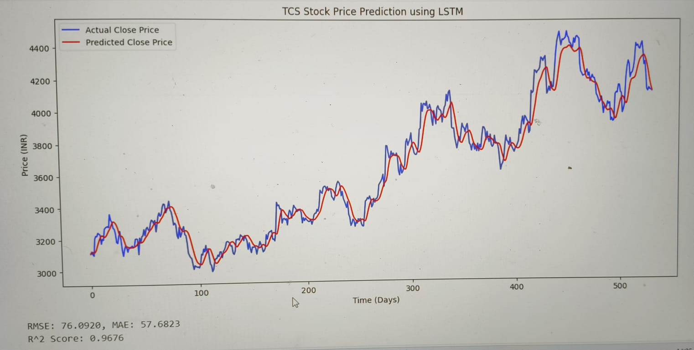

# TCS Stock Price Prediction Using Optimized LSTM

This project predicts the stock price of Tata Consultancy Services (TCS) using a Long Short-Term Memory (LSTM) neural network. The model is trained on 10 years of historical stock data fetched from Yahoo Finance via the `yfinance` library. The implementation is done in a Google Colab notebook, which is uploaded alongside this repo.

## Dataset

- Stock data period: January 1, 2014 to December 31, 2024  
- Features: Open, High, Low, Close, Volume  
- Data scaled between 0 and 1 for model efficiency  

## Model Architecture & Training

- Two stacked LSTM layers (100 units each) with dropout layers (30%) to prevent overfitting  
- Dense layer with 1 neuron for output (predicting next day’s Close price)  
- Early stopping with patience of 5 epochs to avoid overtraining  
- Trained for up to 50 epochs with batch size 32  
- Predicts next day’s closing price based on previous 60 days data  

## Results

- **R² Score:** 0.9676 (very strong prediction accuracy)  
- **RMSE:** 76.09  
- **MAE:** 57.68

## Visualization

The model output includes a plot comparing the actual vs predicted closing prices on the test set, showing a strong alignment between predictions and reality.

## How to Run

1. Open the [Google Colab Notebook](./stock-market-prediction.ipynb).  
2. Run the notebook sequentially to reproduce the results.  
3. No setup needed locally as all dependencies are managed in Colab.

---

### Contact

- Email: koyelkhamaru3@gmail.com

---
